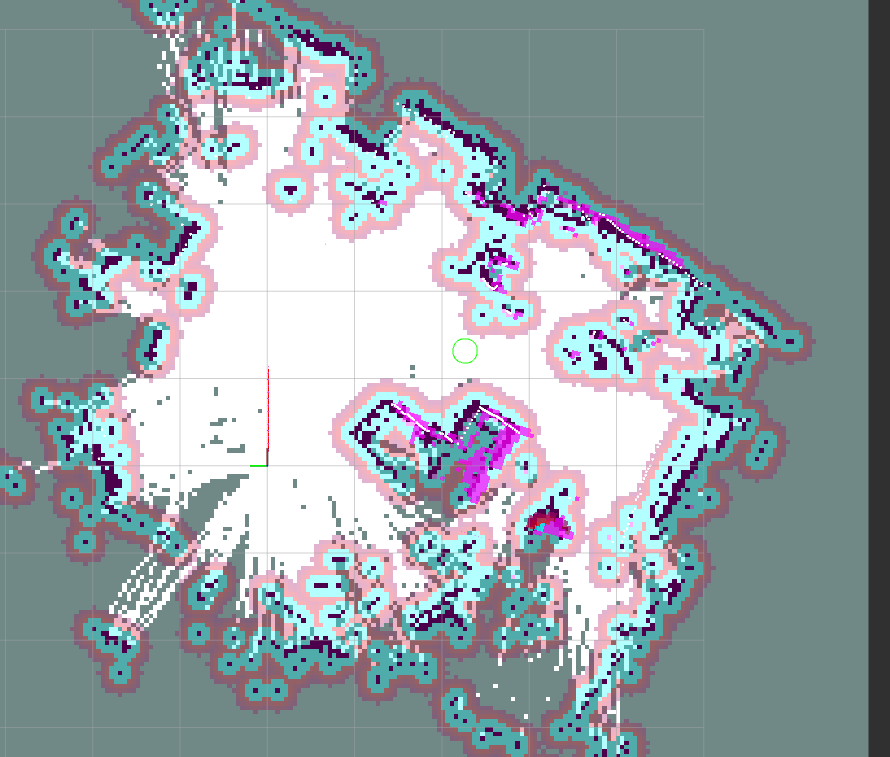

## 1. Общие сведения

Настоящий документ описывает архитектуру, принципы работы и настройку системы сервера на **ROS2** для картографирования и перемещения по построенной карте управляя [VacRobot](https://github.com/TokyPhuko/VacRobot).

В текущей реализации обеспечены:
- Рассчет одометрии на основе объединения на основе алгоритма лидарной навигации RF2O, данных imu (MPU6500, MPU6050) при помощи EKF (Расширенный фильтр Кальмана).
- Подключение к ESP32 по её ip внутри локальной сети и взаимодействие с ней через websocket.
- slam_toolbox (без влияния на TF).
- nav2 для построения маршрпута и перемещения до заданных точек.
- Добавлен узел для самостоятельного полного исследования карты, но он нужлается в доработке.
- Существуют кастомные деревья перемещений (для исключения типа движения `spin`).

---
## 2. Запуск системы

Полный запуск системы можно осуществить при помощи `mapping_launch.py`

```bash
cd ~/ros2_ws  
colcon build --packages-select VacServer  
source install/setup.bash 
ros2 launch VacServer mapping_launch.py
```

---

## 3. rf2o_node

Узел для запуска соответствующего алгоритма лидарной одометрии.

**ВАЖНО:** прямого влияния на TF не имеет, публикует данные в топик `/odom` с частотой 40Гц.

---
## 4. RobotClientNode

Основной узел этого ROS2 проекта, в отдельные параметры вынесены только минимальное и максимальное рассстояние до точек лидара и ip ESP32. Внутри `RobotClientNode.py` можно так же изменить:
1. `half_base = 0.11` половины длины базы (оси) робота.
2. `gain = 270` коэффицент мощности для отправляемого ШИМа на моторы.
   Данные параметры нужны для преобазования публикуемого в топике `/cmd_vel` вектора в ШИМ для моторов (публикуется nav2).
Этот же узел публикует `/scan` (LaserScan) и `/imu`.

---

## 5. ekf_node

Узел расширенного фильтра кальмана для того чтобы на основе данных rf2o и imu публиковать изменения в tf->odom. При нулевых ковариациях будет публиковать NAN поэтому матрица `process_noise_covariance` заполнена подобранными значениями. Полный набор парметров лежит в `ekf_params.yaml`.

---

## 6. rviz_node

Используются стандартные настройки визуализации из nav2.


---

## 7. nav2

```python
IncludeLaunchDescription(
    PythonLaunchDescriptionSource(nav2_launch_file),
    launch_arguments={
        'use_sim_time': 'False',
        'params_file': nav2_params_file,
    }.items()
),
```

Запускает все узлы nav2 из файла `nav2_params.yaml`.

---
## 8. slam_toolbox
**ВАЖНО:**
```python
'use_scan_matching': False,
'publish_tf': False,
```

совместное включение этих параметров полностью исключает возможность влияния slam_toolbox на одометрию.

---
## 9. Статические трансформации
Публикуются относительно базы робота.

Пример:
```python
Node(
    package='tf2_ros',
    executable='static_transform_publisher',
    arguments=['-0.15', '0', '0', '0', '0', '0', 'base_link', 'laser_link'],
    name='static_tf_lidar'
),
```

---

## 10. explore_node

В данной конфигурации отключен, должен при включении публиковать цели для робота куда бы тот ехал для исследования неизведанных зон. (рисуется розовой линией в rviz).